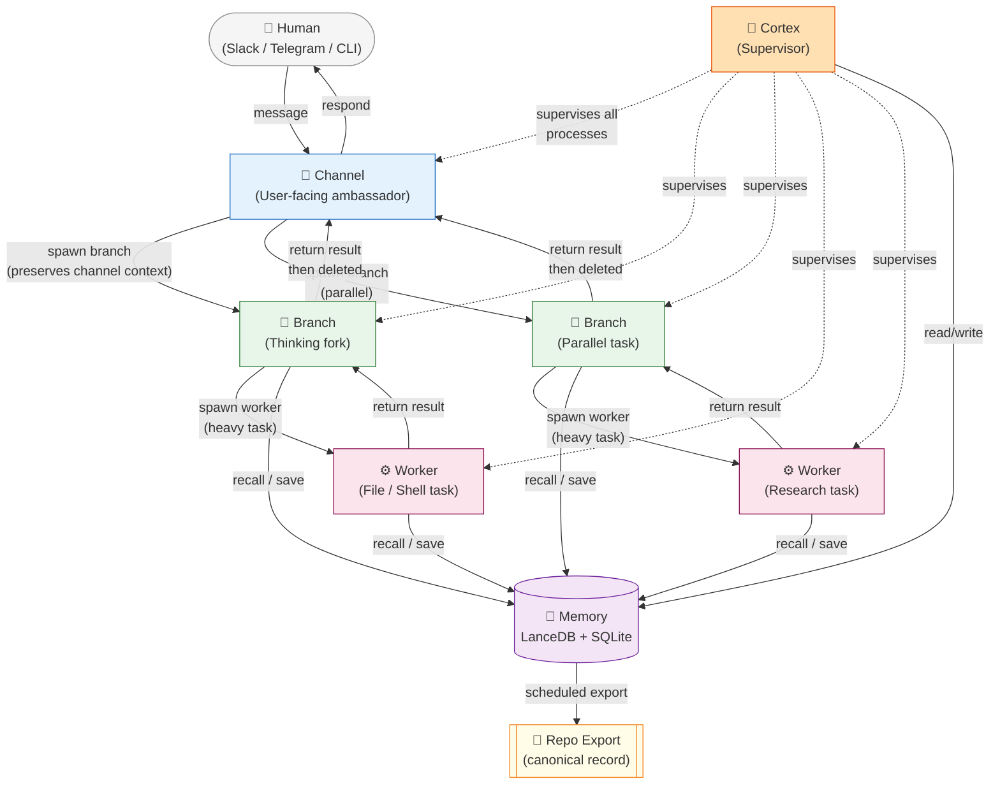
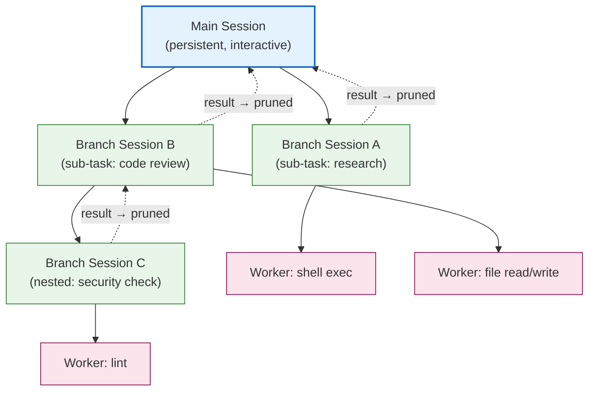
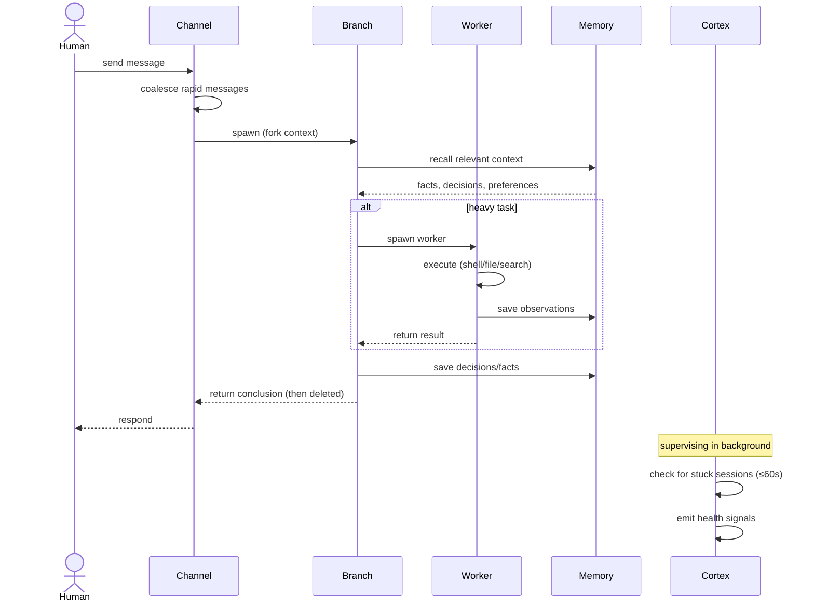
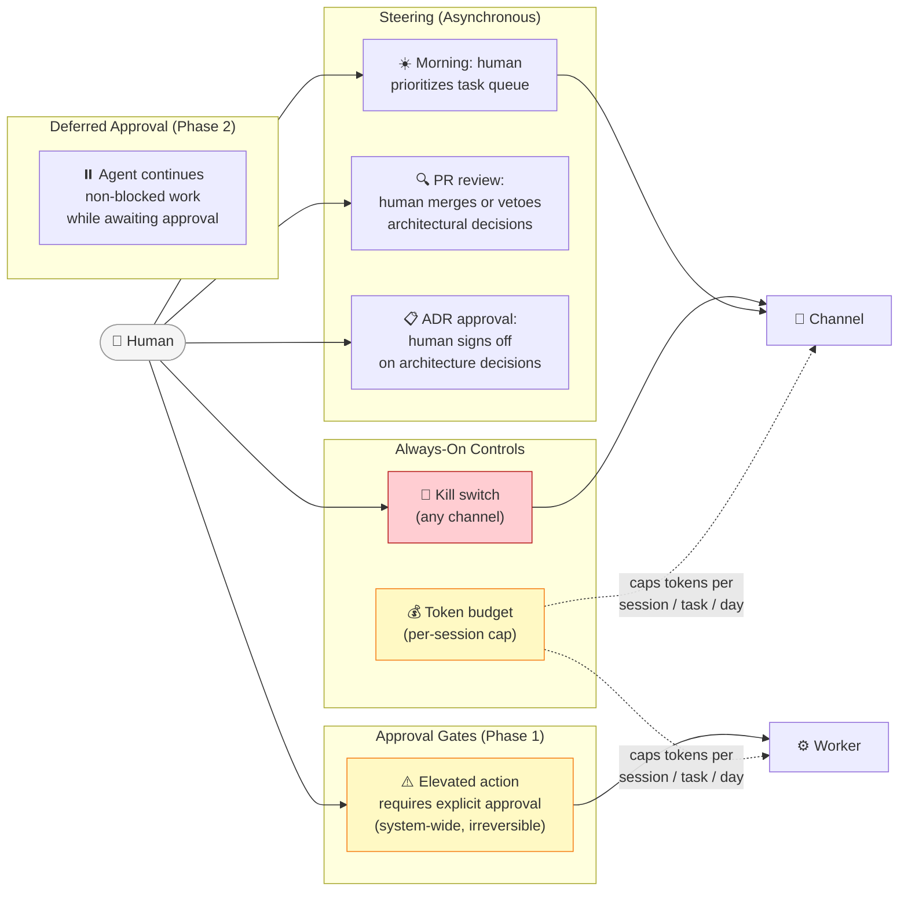
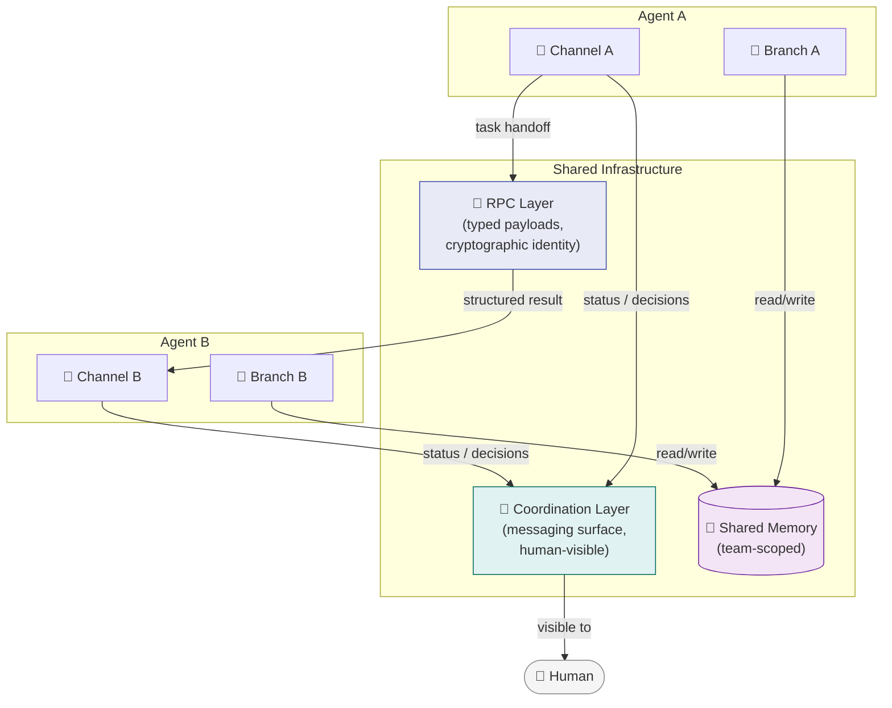
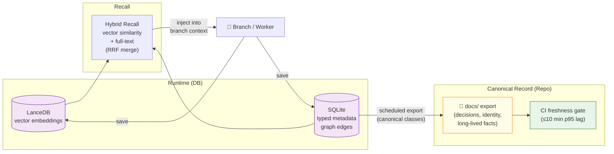
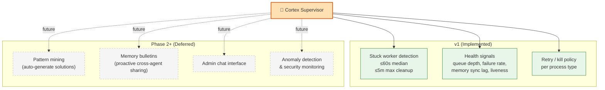
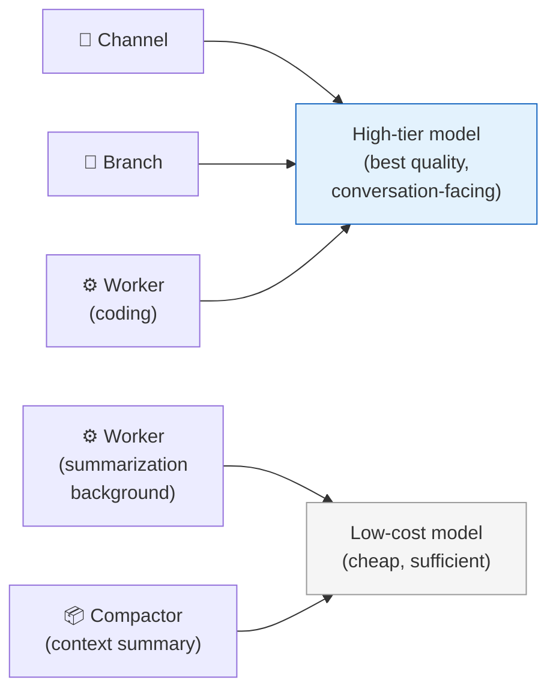

# Agent Orchestration Org Chart

**Status:** Current design as of 2026-03-04 (v1 implementation + full vision)
**Sources:** PRD v2, VISION.md, ROADMAP.md, Spacebot analysis, `src/core/session.rs`, `src/cortex/mod.rs`

---

## 1. Process Hierarchy

The top-level view: who talks to whom, and who supervises whom.

---

## 2. Session Tree Model

Sessions are trees, not flat lists. Branches are scoped, pruned after use; audit trails are preserved.

**Key properties:**
- Main session is always responsive — it never does heavy work directly
- Branch sessions fork the Channel's context; Worker sessions start fresh (task prompt only)
- Branches are deleted after returning results; audit trails remain (per VISION.md: "every decision path is preserved")
- Nesting is allowed (Branch can spawn Branch), but depth should be kept shallow

---

## 3. Task Flow: End-to-End

A single user message from receipt to response.

---

## 4. Human Intervention Points

Where humans can steer, approve, or stop.

### Intervention Tiers (from VISION.md)

| Tier | Scope | Human action required |
|------|-------|----------------------|
| Read-only | Observe, never mutate | None |
| Workspace-scoped | Mutate within workspace | None (default allowed) |
| System-wide | Mutate outside workspace | Approval |
| Elevated | Irreversible / high-impact | Explicit human approval |

---

## 5. Multi-Agent Architecture (Phase 2)

When multiple agents collaborate — two communication channels by design.

**Trust model:** Each agent trusts its primary human fully. Agents treat other agents as collaborators, not authorities — agent-to-agent messages do not bypass human approval gates for elevated actions.

---

## 6. Memory Flow

How knowledge moves from runtime to canonical record.

**Canonical memory classes** (always exported to repo): Decision, Identity, long-lived Fact, Goal state transitions.

**Export SLO:** p95 lag ≤ 10 minutes, enforced in CI on release branches.

---

## 7. Cortex Supervision (v1 Scope)

Cortex sees across all processes. v1 scope is deliberately narrow.

---

## 8. Model Routing by Process Type

Different processes get different model tiers (cost optimization).

---

## Summary: Who Spawns What

| Actor | Can spawn | Can terminate¹ | Supervises |
|-------|-----------|----------------|------------|
| Human | — | Any (kill switch) | Steers via approval gates |
| Cortex | — | Stuck workers/branches (forceful) | All processes |
| Channel | Branch | Own branches (lifecycle cleanup) | — |
| Branch | Worker, nested Branch | Own workers (lifecycle cleanup) | — |
| Worker | — | — | — |

¹ "Terminate" has two meanings here: Cortex **forcefully kills** stuck processes that exceed the timeout threshold (active intervention). Channel and Branch **clean up** their children after those children return results — this is normal lifecycle completion, not a kill action. The kill switch available to humans bypasses all of this and terminates any process immediately.
